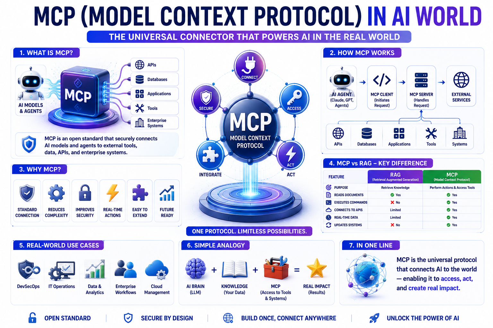
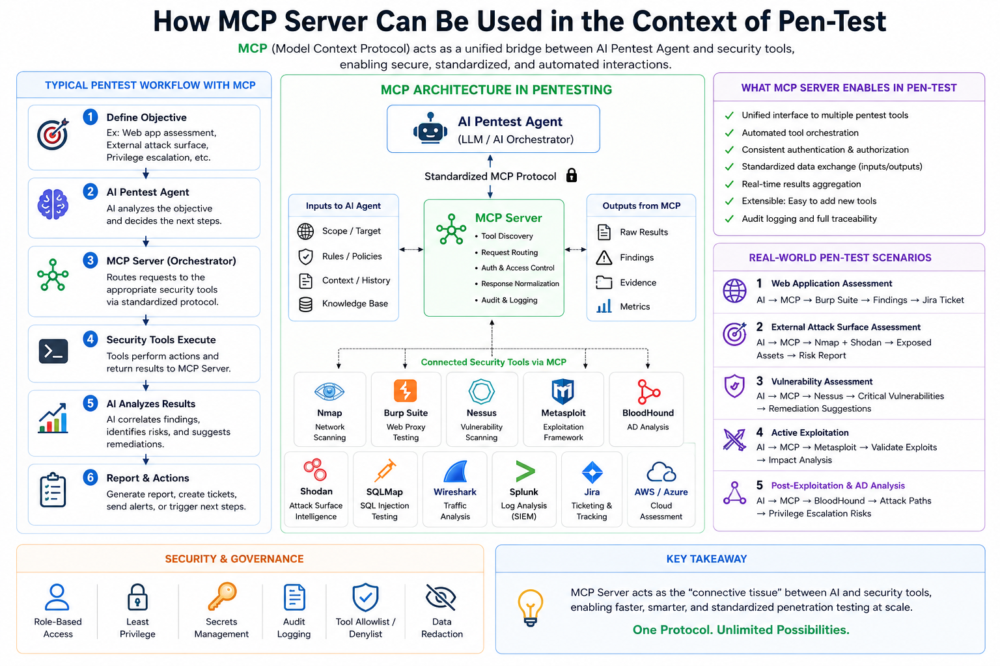
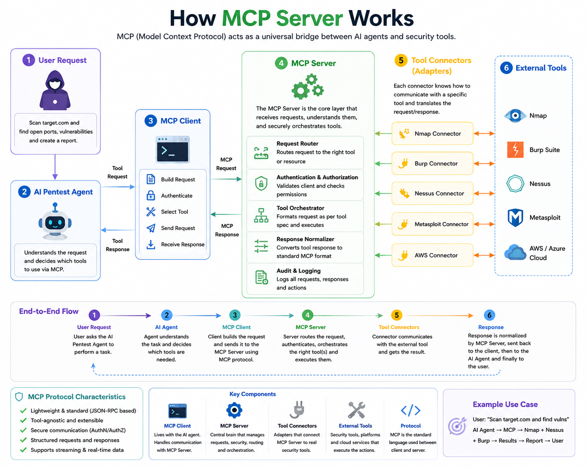
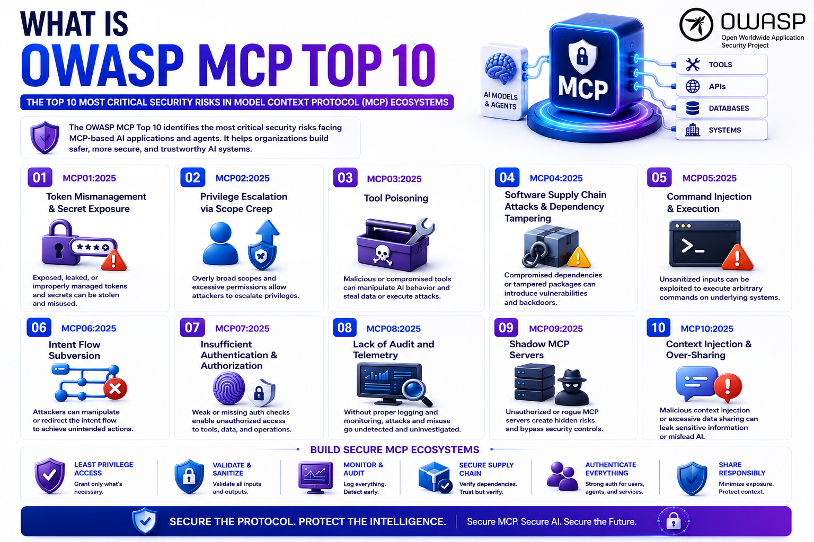
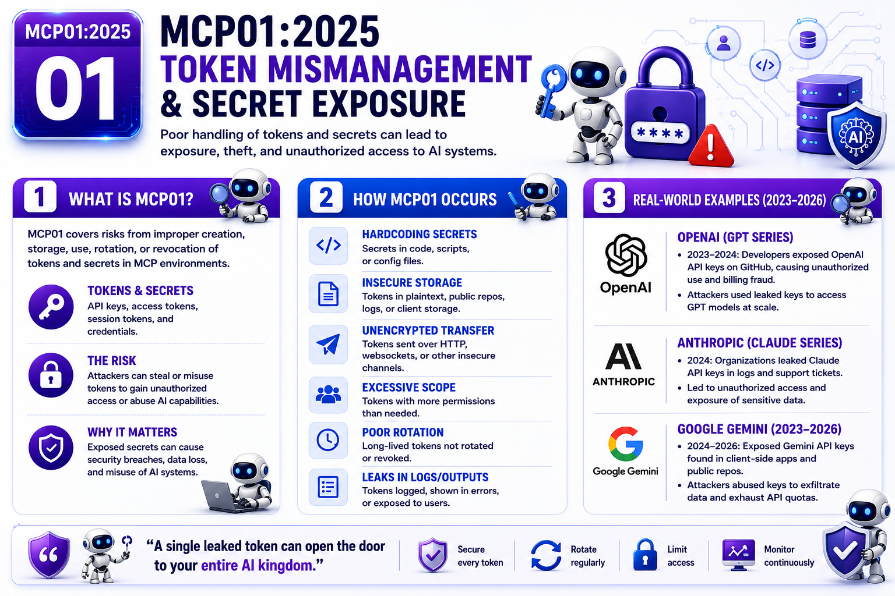
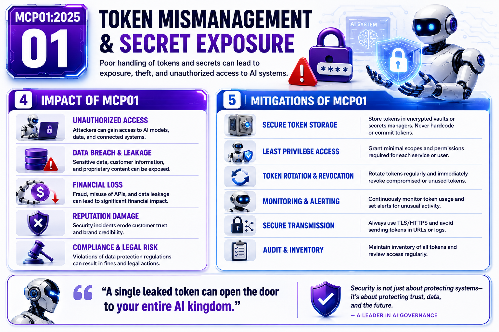

<!-- This is slide 1 -->
## OWASP MCP Top 10

The OWASP Model Context Protocol (MCP) Top 10 is a security framework that highlights the most critical risks facing MCP-enabled AI applications and agents, helping organizations build safer, more secure, and trustworthy AI systems.

---
---

<!-- This is slide MCP01-1 -->

---

## MCP Server for Application Security Testing (AST)

MCP (Model Context Protocol) connects AI Security Agents with Application Security tools such as SAST, DAST, SCA, and API Security. 
It enables automated scan orchestration, centralized findings, and risk-based remediation through a single protocol. MCP improves efficiency with secure authentication, audit logging, and standardized data exchange.

---

# How MCP (Model Context Protocol) Works

MCP acts as a universal communication layer between AI agents and external tools, enabling secure, standardized, and automated interactions. The AI agent sends requests through the MCP Server, which authenticates, routes, and orchestrates the appropriate tools, then normalizes the results into a consistent format. This allows AI systems to seamlessly leverage multiple tools and services through a single protocol without requiring custom integrations.

## User → AI Agent → MCP Server → Tool Connectors → External Tools → Results

---

<!-- This is slide MCP01-2 -->

---

<!-- This is slide MCP02-1 -->

---

<!-- This is slide MCP02-2 -->

---

<!-- This is slide MCP03-1 -->

---

<!-- This is slide MCP03-2 -->

